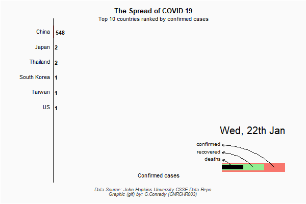
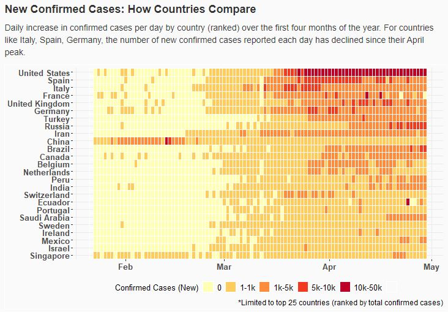

# COVID-19: Data Animation in R (and RStudio)

<p align="center">
  
</p>

## Ready, set, gif!

The _bar chart race_, a type of bar chart but with a little more pizazz, has gone viral across social media platforms. The appeal is obvious: it's flashy (literally), informative, and pretty easy to make. In this repository, I share the code [here](https://github.com/cconrady/Data-Animation-in-R/tree/main/code) to create a bar chart race for yourself using [R](https://www.r-project.org/) and the popular IDE, [RStudio](https://www.rstudio.com/products/rstudio/).

Take some time now to clone the repo (or download the code) and follow the installation instructions.

Got it working? Great!

Now go ahead and delete it.

## Why the bar chart race is a pretty bad idea.

The success of a bar chart lies in its simplicity. When it comes to comparing the values of things, especially categories of things, the bar graph is one of the most commonly used visualisations, and for a good reason. It’s intuitive, easy to read and quick to interpret even for those without a background in data. But this simplicity comes at a cost. a typical bar chart will
convey at most two dimensions of data, and is less useful for showing how this data changes over time, for example.

When you break it down, a bar chart race is essentially a stack of bar charts stitched together and revealed sequentially, one at a time (imagine using your thumb to fan a stack of Post-it Notes). This means a bar chart race can visualize an additional dimension of data (for a minimum of three dimensions) on a two-dimensional plane. But it's not exactly a win-win, I'd call it a win-loss, and here's why.

Consider the below heatmap (also done using R, by the way). It's known as a "static" visualization, as in it's not animated like the bar chart race. In fact, it conveys the very same information as the bar chart race at the top of the page, but *all at once*.

<p align="center">
  
</p>

Do a quick test yourself, here's a few things you should have noted from the bar chart race. Can you get the same information from the heatmap? The big difference with the heatmap is that you get all of this information almost instantaneously. And that's pretty important when it comes to designing "good" visualisations<sup>\*</sup>.

- Starting in February and heading into March, there is a large increase in China of new confirmed cases per day. This peaks in February and steadily reduces heading into April.

- Europe becomes the new epicenter of COVID-19 by the end of March as daily confirmed cases spike in Italy, Spain, Germany and the UK. 

- The United States replaces Europe as the epicenter of COVID-19, experiencing the highest spike in daily confirmed cases of all countries considered.

<em><sup>\*</sup>So there's a way to grade a visualization, like on a discrete scale of "bad" or "good". And it's this: consider that a visualization exists only to answer a question. Does it answer this question *well* and *quickly*, then it's a good visualization. Does it take a second glance, a bit of explanation, to get your point across? Then it's a "bad" visualization.</em>

It's like seeing the formation of the universe, all the ice ages, the extinction of dinosaurs, the first and second world wars, right up to the present day, everything that is and has ever been, all at once. So ditch the bar chart race, and the linear propogation of time in animations. It's old-fashioned. It's analog. And you're better than that.

PS. Here are some resources that were invaluable in creating this repo [1](https://towardsdatascience.com/channel-your-creativity-interactive-and-animated-graphics-in-r-with-covid-19-data-5f7bede4b29f), [2](https://towardsdatascience.com/create-animated-bar-charts-using-r-31d09e5841da), [3](https://towardsdatascience.com/https-towardsdatascience-com-everything-you-need-to-know-about-animated-bar-charts-be033f398619), [4](https://medium.com/@korkmazarda1/creating-an-animated-bar-plot-in-r-de9200f57506).

PPS. Because I found a way to include recovery and death data in the bar chart race (by simply overlaying them, each slightly smaller in width), the bar chart race actually conveys two more dimensions than the heatmap, and because of this gives a lot more information and can answer more questions. But what did you except me to do? I was already halfway through this post when I realised that, and I wasn't about to start over.

## Installation

Visit the official site for [RStudio](https://www.rstudio.com/products/rstudio/) and follow the installation instructions. It's a simple "download and double-click" type of installation. You'll also have to do the same for [R](https://www.r-project.org/). When you've got RStudio setup, create a new notebook (`File`, then `New File`, then `R Notebook`). Finally, paste the below into the first cell or block. That's it! RStudio will automatically find and download the packages for you (if you haven't already got them).

```r

## data frame manipulation
if(!require(tidyverse)) {install.packages("tidyverse"); library(tidyverse)}
if(!require(lubridate)) {install.packages("lubridate"); library(lubridate)}

### animated plots
if(!require(ggplot2)) {install.packages("ggplot2"); library(ggplot2)}
if(!require(gganimate)) {install.packages("gganimate"); library(gganimate)}
if(!require(transformr)) {install.packages("transformr"); library(transformr)}
if(!require(gifski)) {install.packages("gifski"); library(gifski)}
if(!require(av)) {install.packages("av"); library(av)}

### labelling plots
if(!require(directlabels)) {install.packages("directlabels"); library(directlabels)}
if(!require(ggrepel)) {install.packages("ggrepel"); library(ggrepel)}
  
```